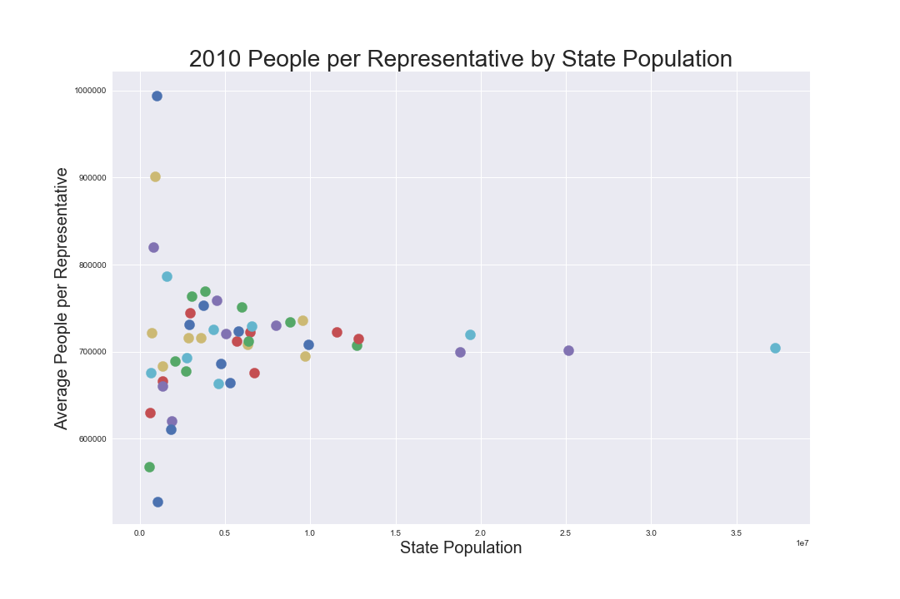

# Observations from Census Data

**[Observations from Census Data](https://towardsdatascience.com/fun-with-census-data-2643ecd266c4)**
is an article I wrote on *Towards Data Science* in July 2017. 




## Files

The Jupyter noteboos ```Census_Final.ipynb``` contain the finalized version of the post, and ```Census_Final.html``` is an HTML version of the same. Exploratory analysis is in ```notebooks/Census Blog Post.ipynb```. 

## Dataset 

I used US Census data from 1920 through 2010, available [here](https://www.census.gov/2010census/data/). See files in ```data/```.
